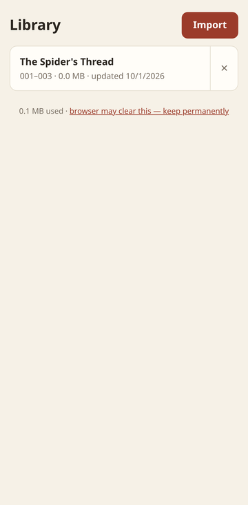
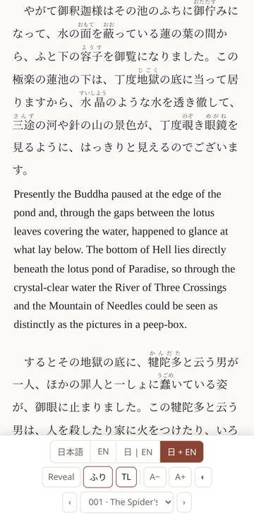
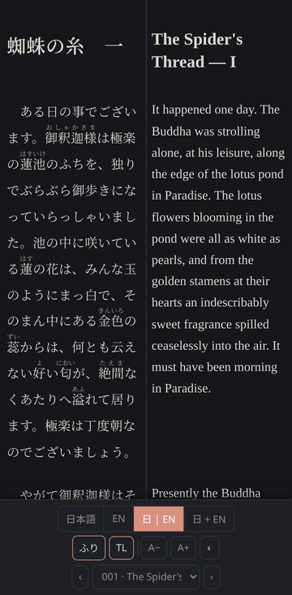
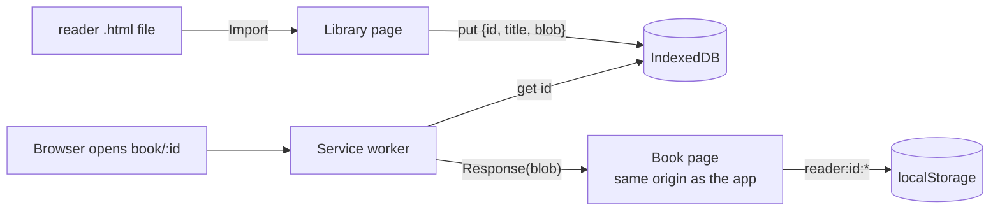

# TL Reader

[](https://github.com/kreir42/tl-reader/actions/workflows/ci.yml)
[](LICENSE)

An offline, installable web app for reading bilingual Japanese–English books on a phone. It is built with no framework, no build step and no runtime dependencies.

**Live app:** <https://kreir42.github.io/tl-reader/>. Tap **Try a sample** to load Akutagawa's *The Spider's Thread*.

<p>
  
  
  
</p>

## The problem

I study Japanese by reading web novels side by side with my own translations. Each book is one self-contained HTML file with four reading modes (Japanese, English, side by side, and interleaved with spoilers), furigana, translator's notes and chapter navigation. The file saves your place and settings in `localStorage`.

That works on a desktop. On Android it falls apart:

- **Firefox** won't open local HTML files at all.
- **Chrome** opens them through a `content://` URL, which gets a new origin every time. When the browser is closed, the saved position and settings are gone.

TL Reader gives every book a permanent home on one origin, offline, without changing how the book files work.

## Features

- **Import** reader files from the device. Re-importing a book replaces it, and your place survives, even when Android has renamed the download to `book (1).html`.
- **Per-book memory:** each book keeps its own reading position, mode, text size and theme.
- **Fully offline** once installed. Books are stored on the device and never uploaded.
- **Safe updates:** a new release of the app shows an *Update ready* prompt rather than swapping code under an open book.
- **Native text selection,** so words can be sent to a dictionary app with long-press.
- **Light and dark themes** that follow the system.

## How it works



- **Books are served from a URL that exists only inside the service worker.** `book/<id>` is answered from IndexedDB and is never fetched over the network. Each book loads as a normal top-level page on the app's origin, so its own `localStorage` logic works unchanged, and text selection, scrolling and the back gesture behave natively. An `<iframe>` or `blob:` URL would have needed changes inside the book.
- **Book identity** comes from `<meta name="reader-book" content="<id>">` in the file's header. The app only reads the first 8 KB of a 10 MB file to find it. Files without the tag fall back to a slug of the file name.
- **Namespaced state:** all books share one origin, so each book stores its state under `reader:<id>:` and deleting a book clears only its own keys.
- **Update flow:** the service worker never calls `skipWaiting()` on its own. When a new version installs, the page shows a prompt, and only a tap activates it and reloads. The old cache is deleted by name on activation.
- **GitHub Pages fallback:** if a `book/…` link is opened before the worker controls the page (first visit, hard reload), Pages serves `404.html`, which sends you back to the library.
- **Storage durability:** the app asks for persistent storage after the first import, so the browser won't clear books under storage pressure, and shows the current status in the footer.

### Reader file format

Any HTML file works. To get replace-on-import and isolated state, a file should:

1. declare `<meta name="reader-book" content="<id>">`, and
2. keep its `localStorage` keys under `reader:<id>:`.

The files I read are generated from aligned chapter text files by a script in my private translation workspace. [`app/sample/`](app/sample) contains one, built from the source texts in [`sample/`](sample).

## Project layout

```
app/                  the deployed site (static files only)
  index.html          library UI
  app.js              import, library, storage status, update prompt
  db.js               IndexedDB wrapper shared by page and service worker
  sw.js               offline cache + book/<id> route
  404.html            GitHub Pages fallback
  sample/             bundled public-domain sample book
tests/
  app.spec.js         end-to-end tests (Playwright)
  serve.js            dev server that mirrors GitHub Pages
sample/               source texts for the sample book
.github/workflows/    CI: test, then deploy
```

## Development

```sh
npm install
npm start                              # http://localhost:4173/tl-reader/
npx playwright install firefox chromium
npm test
```

The end-to-end suite runs in **Firefox** (the main target) and **Chromium** with a Pixel 7 profile. It covers:

- importing a book and opening it at its stable URL
- restoring position and mode after leaving a book
- replacing a book from a renamed download
- keeping state separate between books, and deleting one book's state only
- offline use
- the update prompt
- the GitHub Pages fallback

`tests/serve.js` serves `app/` under `/tl-reader/` exactly as Pages does, plus a test-only endpoint that simulates a new release.

## Deployment

Every push to `main` runs the test suite. GitHub Pages deploys `app/` only if the tests pass.

To ship a change:

1. Bump `VERSION` in `app/sw.js`. Browsers only detect an update when `sw.js` changes.
2. If you added a new file to the app, add it to `SHELL` in `app/sw.js`.
3. Push.

Installed copies show *Update ready* the next time they're opened.

## Install on Android

1. Open the live app in Firefox. Choose menu → **Add app to Home screen**. In Chrome, choose **Install app**.
2. Tap **Import** and pick a reader `.html` file.
3. When Firefox asks whether the app may store data permanently, allow it.

## Credits

The sample is 蜘蛛の糸 (*The Spider's Thread*, 1918) by Akutagawa Ryūnosuke, which is in the public domain. The Japanese text comes from [Aozora Bunko](https://www.aozora.gr.jp/cards/000879/card92.html). The English translation is my own.

## License

[MIT](LICENSE)
